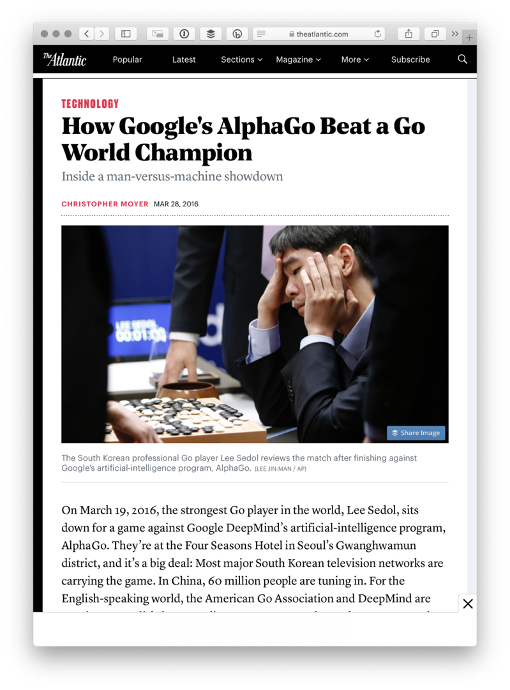

footer: @parisba / #pyconau
theme: Business Class

# Building, designing, teaching and training simulation environments for Machine Learning

## Paris Buttfield-Addison

---

# Paris Buttfield-Addison

- professional game developer
- enjoyer of machine learning
- (enthusiastic) amateur Pythonista
- PhD in Computer Science
- whippet enthusiast


---


^ I write a lot of books.

---


^ And we build a lot of video games.

---

# This topic is Python-adjacent

- Unity is C#
- Unity does the simulation-y, scene-y stuff
- Python does the ML heavy lifting

^ I love Python, but the primary work in using the technology I'm talking about today is not Python.

---

# The Pieces

- a game engine (Unity)
- a machine learning framework (TensorFlow)
- something to glue them together (Unity ML-Agents)

---

^ This is Unity. Unity is some ridiculously high percentage of the games industry. I'm not here to debate the relative merits of Unity. It just happens to be the one we use a lot.

---

> A game engine is controlled, self-contained spatial, physical environment that can _[closely]_ replicate _[enough of]_ the real world _[to be useful]_.

^ A game engine is basically enough of the real world that you can simulate the real world to a sufficient level to play with all sorts of things. This can be called a an AI biodome. A synthetic environment that’s a replica of the real world, combined with Machine Learning infrastructure. 

---




^ This is connected to the explosion of very visual AI problem solving that’s popped up lately, from visual, like the computer player doom, to physics-based, like the critters learning to walk, to cognitive, like AlphaGo’s DeepMind. Lots of different environments doing all sorts of reinforcement learning lately.

^ In a game engine, you can build a complex environment that reflects something you might be working with, or interested in in the real world, in a really trivial way. You can incorporate real-time observations that come from positions and metrics of objects in the scene, but because it’s a game engine you can also use observations from in-engine cameras of all kinds, and perform your learning and training using those inputs, combined with sensors.

---


---


---

<!-- Learn how:
 * straightforward a game engine can be 
 * how to define and lay out your environment for ML problem solving 
 * how to choose and apply different ML techniques, algorithms, and learning approaches, such as (deep) reinforcement learning, imitation learning, and curriculum learning 
* how generic but powerful Python-powered algorithms, such as PPO (Proximal Policy Optimization) make this new-wave of ML possible * how to tune simulations and pick the right actions, observations, and rewards to optimise your agents 
* how to design for emergent problem solving by your agents, where you’re not quite sure what the optimal solution looks like -->

---
<!-- https://2019.pycon-au.org/talks/building-designing-teaching-and-training-simulation-environments-for-machine-learning -->

<!-- Imagine you’re building a fancy robot-driven warehouse. Your pick, place, and packing robots need to get around quickly, find the right item and put it to the right place without colliding with each other, shelves, or people. But you don’t have any robots yet, and you need to start. Try simulations!

Imagine you’re building a high-volume, expensive, robot-driven warehouse. Your pick, place, and packing robots need to get to the right place quickly, find the right item and sort it to the right place without colliding with each other, the shelves, or people. But you don’t have any robots yet, and you need to start writing the logic. Enter: game engines.

A game engine is controlled, self-contained spatial, physical environment that (can) closely replicate (enough of) the real world (to be useful).

This session will explore how you can use game engines to explore and solve problems——such as the aforementioned robot-driven warehouse——in a simulated environment, without building costly and complicated real-world rigs.


Using the popular, powerful (Mono/C#-based) Unity game engine, and its integration with Python, primarily for TensorFlow, as a case study, this session will explore simulation-driven machine learning.

Game engines are a great place to explore ML and AI. They’re wonderful constrained problem spaces, tiny little ecosystems for you to explore a problem in. Here you can learn how to use them even though you’re not a game developer. It’s a great place to dive in to all the wonderful Python-powered ML- and AI- tools if you’re new to that space. It’s a little bit creative, too. -->

---

[.build-lists: true]

# What you need (Part 1)

1. **Download and install Unity:**
    - https://unity3d.com/get-unity/download 
2. **Build a Simulation:**
    - we're going to build a self-driving car
3. **Play it like a game:**
    - drive that car!

---

[.build-lists: true]

# What you need (Part 2)

1. **Create a Python 3.6 environment and activate:**
   - `conda create -n UnityMLEnv python=3.6`
   - `conda activate UnityMLEnv`
2. **Install TensorFlow 1.7.1:**
   - `pip install tensorflow==1.7.1`
3. **Install ML-Agents:**
   - `pip install mlagents`

^ After you're got Unity, what do you need?

---

# You need a problem

---

# Brain
# Academy
# Agent

^ There are three key components…
^ Brain, Academy, and Agent
^ …Let’s look at these one by one.

---

# Brain

- Holds logic for the Agent’s decision making
- Determines which action(s) the Agent should take at each instance
- Receives observations from the Agent
- Receives rewards from the Agent
- Returns actions to the Agent
- Can be controlled by a human, a training process, or an inference process

^ The Brain is the component which encapsulates the logic for making decisions (for the Agent(s)). 

---

# Academy

- Orchestrates the observations and decision making process
- Sets environment-wide parameters, like speed and rendering quality
- Talks to the external communicator
- Make sure agent(s) and brain(s) are in sync
- Coordinates everything

^ The Academy is the component which orchestrates the observation and decision making process.  Controls the training environment and simulation.

---

# Agent

- Attached to a Unity Game Object
- Generates observations
- Performs actions (that it’s told to do by a brain)
- Assigns rewards 
- Linked to one Brain

^ The Agent is the component which performs some sort of action.

---

# Brain
# Academy
# Agent

^ So that’s Academies, Brains, and Agents. In a little more detail…

---

TODO: Image

^ A typical setup might look a bit like this.

---

TODO: Image


^ But in many cases it’s a one-to-one-to-one mapping.

---

# Training and Learning Methods

- reinforcement learning
- imitation learning
- neuroevolution


---

# Robot Warehouse


---


---

[.autoscale: true]

# The Process


1. Define a Problem
2. Build an Environment
3. Create an Agent
4. Pick an Approach
5. Implement Actions
6. Implement Observations
7. Implement Rewards
8. Train, Test, Repeat
 
---

TODO: the steps that go here 

---

# Implementing Actions

```csharp
public void MoveAgent(float[] act)
{
  Vector3 dirToGo = Vector3.zero;
  Vector3 rotateDir = Vector3.zero;

  int action = Mathf.FloorToInt(act[0]);

  switch(action) {
      case 1:
          dirToGo = transform.forward * 1f;
          break;
      case 2:
          dirToGo = transform.forward * -1f;
          break; 
      case 3:
          rotateDir = transform.up * 1f;
          break;
      case 4:
          rotateDir = transform.up * -1f;
          break;
      case 5:
          dirToGo = transform.right * -0.75f;
          break;
      case 6:
          dirToGo = transform.right * 0.75f;
          break;           
  }
  transform.Rotate(rotateDir, Time.fixedDeltaTime * 200f);
  agentRB.AddForce(dirToGo * academy.agentRunSpeed, ForceMode.VelocityChange);
}
```

^ This is a bit of a long one, so we'll go through it in pieces instead.

---

# Implementing Actions

[.code-highlight: all]
[.code-highlight: 1-2, 9]
[.code-highlight: 3]
[.code-highlight: 4]
[.code-highlight: 6]
```csharp
public void MoveAgent(float[] act)
{
	Vector3 dirToGo = Vector3.zero;
	Vector3 rotateDir = Vector3.zero;

	int action = Mathf.FloorToInt(act[0]);

	// ...more code...
}
```

^ We implement our actions in a function that we create, called MoveAgent. First, we need some temporary variables. Nothing particularly interesting.

---

# Implementing Actions

[.code-highlight: all]
[.code-highlight: 1-2, 15]
[.code-highlight: 3-4]
[.code-highlight: 5-6]
[.code-highlight: 7-8]
[.code-highlight: 9-10]
[.code-highlight: 11-12]
[.code-highlight: 13-14]


```csharp
switch(action) 
{
   case 1:
       dirToGo = transform.forward * 1f; break;
   case 2:
       dirToGo = transform.forward * -1f; break; 
   case 3:
       rotateDir = transform.up * 1f; break;
   case 4:
       rotateDir = transform.up * -1f; break;
   case 5:
       dirToGo = transform.right * -0.75f; break;
   case 6:
       dirToGo = transform.right * 0.75f; break;           
}
// ...more code...
```

---

# Implementing Actions

[.code-highlight: all]
[.code-highlight: 1]
[.code-highlight: 2]
[.code-highlight: 3]
[.code-highlight: all]


```csharp
transform.Rotate(rotateDir, Time.fixedDeltaTime * 200f);
agentRB.AddForce(dirToGo * academy.agentRunSpeed, ForceMode.VelocityChange);
```

---

# Implementing Actions

[.code-highlight: all]
[.code-highlight: all]
[.code-highlight: 3-6]
[.code-highlight: 8-21]
[.code-highlight: 23-24]
[.code-highlight: all]

```csharp
public void MoveAgent(float[] act)
{
  Vector3 dirToGo = Vector3.zero;
  Vector3 rotateDir = Vector3.zero;

  int action = Mathf.FloorToInt(act[0]);

  switch(action) {
      case 1:
          dirToGo = transform.forward * 1f; break;
      case 2:
          dirToGo = transform.forward * -1f; break; 
      case 3:
          rotateDir = transform.up * 1f; break;
      case 4:
          rotateDir = transform.up * -1f; break;
      case 5:
          dirToGo = transform.right * -0.75f; break;
      case 6:
          dirToGo = transform.right * 0.75f; break;  
  }

  transform.Rotate(rotateDir, Time.fixedDeltaTime * 200f);
  agentRB.AddForce(dirToGo * academy.agentRunSpeed, ForceMode.VelocityChange);
}
```

---

# Implementing Observations

---

# Implementing Observations

[.code-highlight: all]
[.code-highlight: 1-2, 8]
[.code-highlight: 3]
[.code-highlight: 4]
[.code-highlight: 5]
[.code-highlight: 6-7]

```csharp
public override void CollectObservations()
{
   var distance = 12f;
   float[] angles = { 0f, 45f, 90f, 135f, 180f, 110f, 70f };
   var objects = new[] { "crate", "goal", "wall" };
   AddVectorObs(rayPer.Perceive(distance, angles, objects, 0f, 0f));
   AddVectorObs(rayPer.Perceive(distance, angles, objects, 1.5f, 0f));
}
```
---

# Implementing Rewards

[.code-highlight: all]
[.code-highlight: 1-2, 5]
[.code-highlight: 3]
[.code-highlight: 4]
[.code-highlight: 3-4]
[.code-highlight: all]

```csharp
public override void AgentAction(float[] vectorAction, string textAction)
{
  MoveAgent(vectorAction);
  AddReward(-1f/ agentParameters.maxStep);
}
```

---

# Implementing Rewards

[.code-highlight: all]
[.code-highlight: 1-2, 4]
[.code-highlight: 3]
[.code-highlight: all]

```csharp
public void IHitWrongGoal(GameObject target, GameObject goal)
{
  AddReward(-5f);
}
```

---


# Implementing Rewards


[.code-highlight: all]
[.code-highlight: 1-2, 16]
[.code-highlight: 3-4]
[.code-highlight: all]
[.code-highlight: 6-15]
[.code-highlight: all]

```csharp
public void IScoredAGoal(GameObject target, GameObject goal)
{
  AddReward(5f);
  Debug.Log("Agent delivered crate!");

  var allGoalsComplete = true;
  foreach(var block in blocks) {
      if(block.IsActive == true) {
          allGoalsComplete = false;
      }
  }

  if(allGoalsComplete){
      Done();
  }
}
```

---