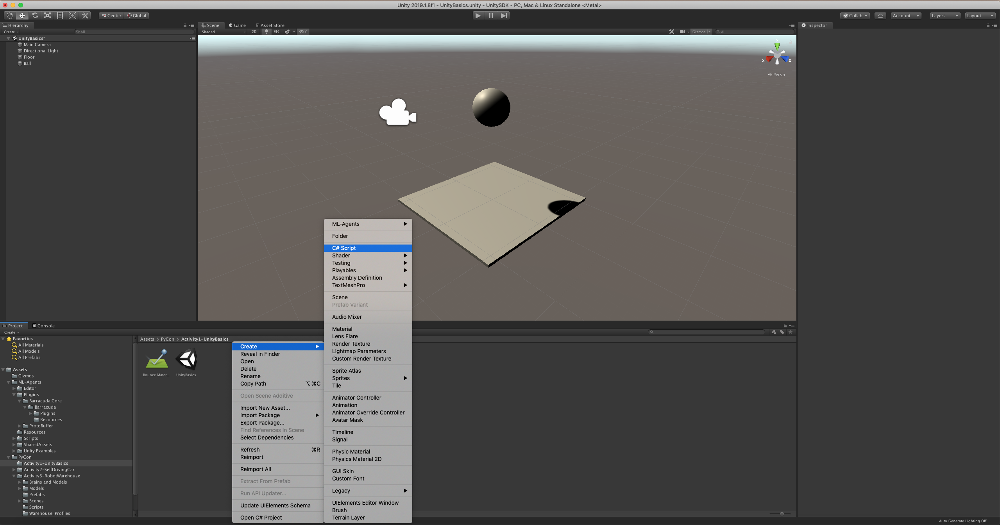

footer: @parisba / #pyconau
theme: Business Class


<!-- Learn how:
 * straightforward a game engine can be 
 * how to define and lay out your environment for ML problem solving 
 * how to choose and apply different ML techniques, algorithms, and learning approaches, such as (deep) reinforcement learning, imitation learning, and curriculum learning 
* how generic but powerful Python-powered algorithms, such as PPO (Proximal Policy Optimization) make this new-wave of ML possible * how to tune simulations and pick the right actions, observations, and rewards to optimise your agents 
* how to design for emergent problem solving by your agents, where you’re not quite sure what the optimal solution looks like -->

<!-- https://2019.pycon-au.org/talks/building-designing-teaching-and-training-simulation-environments-for-machine-learning -->

<!-- Imagine you’re building a fancy robot-driven warehouse. Your pick, place, and packing robots need to get around quickly, find the right item and put it to the right place without colliding with each other, shelves, or people. But you don’t have any robots yet, and you need to start. Try simulations!

Imagine you’re building a high-volume, expensive, robot-driven warehouse. Your pick, place, and packing robots need to get to the right place quickly, find the right item and sort it to the right place without colliding with each other, the shelves, or people. But you don’t have any robots yet, and you need to start writing the logic. Enter: game engines.

A game engine is controlled, self-contained spatial, physical environment that (can) closely replicate (enough of) the real world (to be useful).

This session will explore how you can use game engines to explore and solve problems——such as the aforementioned robot-driven warehouse——in a simulated environment, without building costly and complicated real-world rigs.


Using the popular, powerful (Mono/C#-based) Unity game engine, and its integration with Python, primarily for TensorFlow, as a case study, this session will explore simulation-driven machine learning.

Game engines are a great place to explore ML and AI. They’re wonderful constrained problem spaces, tiny little ecosystems for you to explore a problem in. Here you can learn how to use them even though you’re not a game developer. It’s a great place to dive in to all the wonderful Python-powered ML- and AI- tools if you’re new to that space. It’s a little bit creative, too. -->

# Building, designing, teaching and training simulation environments for Machine Learning

## Paris Buttfield-Addison

^ Hi everyone! It's an honour to be speaking in the Science and Data track of the wonderful PyCon Australia, here on the land of the Gadigal people of the Eora Nation, the traditional custodians of this land. And I pay my respects to their Elders, past and present and emerging.

---

# Very visual machine learning

^ This talk is about very visual machine learning.

---

# Very visual machine learning
## With a bit of Python

^ ... with a bit of Python! 

---

# Paris Buttfield-Addison

- professional game developer
- enjoyer of machine learning
- (enthusiastic) amateur Pythonista
- PhD in Computer Science
- whippet enthusiast


^ My name is Paris. I do all sorts of things, and I'm only really an incidental Python person. I really enjoy Python, though.

---


^ I'm from Tasmania. You should visit.

---


^ I write a lot of books. Many of them related to the topics I'm talking about.

---


^ I build video games at a company I started 12 years ago, called Secret Lab. We're well known for our work on the BAFTA-winning game, Night in the Woods.

---


# This topic is Python-adjacent

- Unity does the simulation-y, scene-y stuff
    - Unity is C#
- Python does the ML heavy lifting
    - via TensorFlow, which is pretty great

^ I love Python, but the primary work in using the technology I'm talking about today is not Python. It's Python adjacent.

<!-- https://pixabay.com/photos/snake-python-green-python-4101998/ -->

---

# The Pieces

1. game engine (Unity)
2. a machine learning framework (TensorFlow)
3. something to glue them together (Unity ML-Agents)


---

This is a quick introduction to the power of simulation-driven machine learning.

---


^ This is Unity. Unity is some ridiculously high percentage of the games industry. I'm not here to debate the relative merits of Unity. It just happens to be the one we use a lot.

---


^ Unity is a pretty standard piece of Pro software. Behaves a lot like most high-end 3D stuff, and just  like almost every other game engine. Here I've added a cube. 

---


^ Now I've squashed the cube, to make it into a floor.

---


^ And I've added a Sphere above it.

---


^ And renamed the cube, which we flattened, to floor, and the sphere, to ball.

---


^ Now, if we play the scene, we'll see what the camera in the scene sees... and nothing else happens.

---


^ If we add a RigidBody Component to our Ball, we can make it affected by Gravity. Once we've added it...

---


^ Clicking Play now results in the ball falling to the ground. But what if we want it to bounce?

---


^ If we add a new Physic Material to the project....

---


^ And set the properties of that to be.. pretty bouncy!

---


^ We can then apply that Phsyic Material to our Ball, which will make it bounce.

---


^ And now, if we play, the ball will bounce!

---



^ If we now create a C# script... called Bounce...

---

# Bounce.cs

[.code-highlight: all]
[.code-highlight: 1-2, 10]
[.code-highlight: 3]
[.code-highlight: 5-9]
[.code-highlight: all]

```csharp
public class Bounce : MonoBehaviour
{
    public bool printDebug = false;
    
    void OnCollisionEnter(Collision c) {
        if(printDebug) {
            Debug.Log(c.gameObject.name + " hit me!");
        }
    }
}
```

^ Our CSharp script looks something like this... 
^ A class... with the same name as the file...
^ A public boolean called printDebug...
^ And an implementation of OnCollisionEnter that, if the printDebug bool is true, prints a line that indicates it hit something.

---


^ And then drag that script onto the Floor, as a component...

---


^ Then click play... if we toggle the boolean tickbox, which is exposed to the inspector because it's public, we'll see it print out every time something hits the floor... which is going to be the ball, every time it bounces.

---

> A game engine is controlled, self-contained spatial, physical environment that can _[closely]_ replicate _[enough of]_ the real world _[to be useful]_.

^ A game engine is basically enough of the real world that you can simulate the real world to a sufficient level to play with all sorts of things. This can be called a an AI biodome. A synthetic environment that’s a replica of the real world, combined with Machine Learning infrastructure. 

---


^ This is connected to the explosion of very visual AI problem solving that’s popped up lately, from visual, like the computer player doom, to physics-based, like the critters learning to walk, to cognitive, like AlphaGo’s DeepMind. Lots of different environments doing all sorts of reinforcement learning lately.

^ In a game engine, you can build a complex environment that reflects something you might be working with, or interested in in the real world, in a really trivial way. You can incorporate real-time observations that come from positions and metrics of objects in the scene, but because it’s a game engine you can also use observations from in-engine cameras of all kinds, and perform your learning and training using those inputs, combined with sensors.

---


---


---

# Let's look at an example!

---

# Let's look at an example!
## You need a problem

---


^ This is ours... but we'll come back to that in a moment.

---

<!-- # Brain, Academy, Agent -->


^ There are three key components…
^ Brain, Academy, and Agent
^ …Let’s look at these one by one.

---


# Brain

- Logic for the Agent decisions
- Receives observations from the Agent
- Receives rewards from the Agent
- Returns actions to the Agent
- Can be controlled by a human, a training process, or an inference process

^ The Brain is the component which encapsulates the logic for making decisions (for the Agent(s)). 
^ Determines which action(s) the Agent should take at each instance

---


# Academy

- Orchestrates observations and decision process
- Sets environmental parameters, like speed and rendering quality
- Make sure agent(s) and brain(s) are in sync
- Talks to Python

^ The Academy is the component which orchestrates the observation and decision making process.  Controls the training environment and simulation.

---


# Agent

- Attached to a Unity Game Object
- Generates observations
- Performs actions (that it’s told to do by a brain)
- Assigns rewards 
- Linked to one Brain

^ The Agent is the component which performs some sort of action.

---


^ An agent does its thing based on actions, observations, and rewards. At eachs step, the brain procides a decision based on the observations of the agent, trying to maximise the reward it gets.

---


^ So that’s Academies, Brains, and Agents. In a little more detail… 

---


^ A typical setup might look a bit like this.

---

# Training and Learning Methods

- reinforcement learning
- imitation learning
- neuroevolution

^ There's all sorts of ways to run the training process on the Machine Learning side.. everything from ... to ...
^ We don't have time to go into these today... so we're going to look at a reinforcement learning example...

---

[.autoscale: true]

# The Process


1. Define a Problem
2. Build an Environment
3. Create an Agent
4. Pick an Approach
5. Implement Actions
6. Implement Observations
7. Implement Rewards
8. Train, Test, Repeat
 
---


[.build-lists: true]

# What you need (Part 1)

1. **Download and install Unity:**
    - https://unity3d.com/get-unity/download 
2. **Build a Simulation:**
    - we're going to build a self-driving car
3. **Play it like a game:**
    - drive that car!

---

[.build-lists: true]

# What you need (Part 2)

1. **Create a Python 3.6 environment and activate:**
   - `conda create -n UnityMLEnv python=3.6`
   - `conda activate UnityMLEnv`
2. **Install TensorFlow 1.7.1:**
   - `pip install tensorflow==1.7.1`
3. **Install ML-Agents:**
   - `pip install mlagents`

^ After you're got Unity, what do you need?

---


^ This is the environment we've built. We built it like a game. It's a nice little race track. 

---


^ This is our car. It's actually more of a bulldozer...

---


^ Attached to our car is this car controler thing, which is part of Unity. It's basically a generic car.

---


^ Also, around the sides of our track, we have these invisible barrier things, the wireframe boxes, which are in green in this image —— apologies if you're colour blind like I am, they can be hard to see.

---


^ These are invisible collision volumes. They're basically fancy triggers. if our car goes through them in 3D space, it doesn't get stopped by the physics engine, but a function on the car is called to tell it it collided with a trigger.

---


---


^ They're just Box Colliders, set to be Triggers, which means they don't make things stop when they hit them. They're basically a brick wall you can pass through. but that will tell you you've passed through it... as it were.

---


^ Our track is also setup with some waypoints, spanning the entire track in order.

---


^ Finally, as you can see here, our car--bulldozer--has a camera mounted to the front of it, pointed forward. Back to that in a minute.

---


^ To get the ML happening, we need some brains. First we need a player brain, which basically just lets us steer the car, as a human, to test it works.

---


^ We also need a Learning Brain. The Learning Brain is setup to understand it has a Visual Observation of 32 pixels by 24 pixels in Grayscale. That's going to be that camera we have attached to the car.

---


^ We also need our Academy object, which is basically just there to mediate what's going on. It knows there's two possible brains, and has some settings about Training and Inference. All these settings do in this case are say that Training runs super fast, without worrying about framerate or high resolution rendering, and inference runs like a game, so we can see it.

---


^ We also set our car agent up as ... the agent. It's setup to kmnow that it has oene camera, and we also tell it about those waypoints we made. This isn't part of the ML system, it's just so the car can be reset to a specific position around the track when it crashes closest to where it crashed. 

---

# Implementing Actions

[.code-highlight: all]
[.code-highlight: 1,14]
[.code-highlight: 2-3]
[.code-highlight: 5-12]
[.code-highlight: 8]
[.code-highlight: 12]
[.code-highlight: all]

```csharp
public override void AgentAction(float[] vectorAction, string textAction) {
    float h = vectorAction[0];
    carController.Move(h, 1, 0, 0);

    // Once the actions are done, we need to check:
    if(isCollided) {
        // we hit something
        AddReward(-1.0f); // you get a punishment, you get a punishment, we all get punishments!
        Done();
    } else {
        // we did not hit something
        AddReward(0.05f); // what a good car you are!
    }
}
```

^ -1 is left, 1 is right
^ When an Agent uses a Brain set to the Continuous vector action space, the action parameter passed to the Agent's AgentAction() function is an array with length equal to the Brain object's Vector Action Space Size property value. The individual values in the array have whatever meanings that you ascribe to them. If you assign an element in the array as the speed of an Agent, for example, the training process learns to control the speed of the Agent though this parameter.

---


^ At this point, we can fire it up, and drive the car around the track using the Player brain. Which just means the control is passed to the keyboard. This is me driving.

---

# Let's add some machine learning...

---


^ To train the car to drive itself, we need to set the academy up for training by ticking the control box next to the Learning brain. This tells Unity to allow Python to control the whole situation over IPC.
^ We also need to swap the brain on the car Agent to point to the Learning brain.

---


^ As a reminder, our Learning Brain is setup to use One camera, the one on the car, as its only observations, and knows how to make vector actions with a space size of one. In summary, the Brain can send either a LEFT, which is -1, or a RIGHT, which is 1, into Unity.

---


^ You can check this by checking back to our Player brain, where the keys are mapped directly. D for Right sends 1, A for left sends -1.

---


^ Anyway, with the academy setup to allow Python to control it. We can turn to that..

---

```yaml
default:
    trainer: ppo
    batch_size: 1024
    beta: 5.0e-3
    buffer_size: 10240
    epsilon: 0.2
    gamma: 0.99
    hidden_units: 128
    lambd: 0.95
    learning_rate: 3.0e-4
    max_steps: 5.0e4
    memory_size: 256
    normalize: false
    num_epoch: 3
    num_layers: 2
    time_horizon: 64
    sequence_length: 64
    summary_freq: 1000
    use_recurrent: false
    use_curiosity: false
    curiosity_strength: 0.01
    curiosity_enc_size: 128
    
PyConCarLearningBrain:
    max_steps: 1.0e6
    batch_size: 100
    beta: 0.001
    buffer_size: 12000
    gamma: 0.995
    lambd: 0.99
    learning_rate: 0.0003
    normalize: true
    time_horizon: 1000
```

^ We need some hyper parameters in a yaml file... 

---


^ We can then fire up the Python environment, point it to our Yaml Hyperparameters file, and let it train...

---


---


---

# What's going on?

1. Left (-1) or Right (1)
2. Collided?
    - Yes: -1.0 Reward
        - Keep going
    - No: 0.05 Reward
        - Reset to closest Waypoint

---


---


---


^ And now...our car can drive!

---

# Thank you!

### @parisba  
### https://hey.paris


---